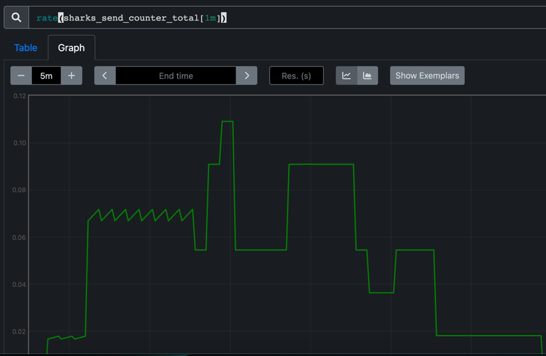
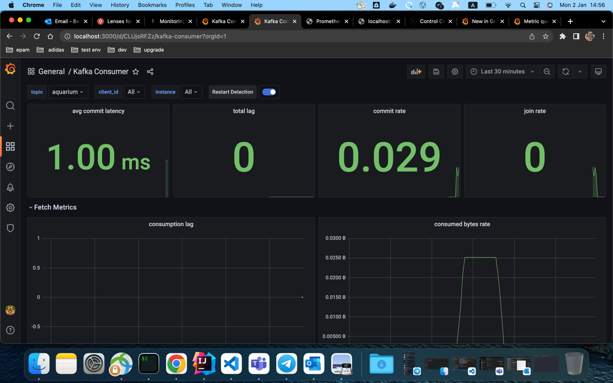

### App for adding shark to aquarium.
This app is producing  mako shark to the aquarium by rest endpoint.
Shark is producing by avro kafka producer to kafka broker using schema registry. Record shema is located in `shark.avsc` file.
Record object is generated by maven.

---
#### Environment:
- docker env can be found in `docker-compose.yaml` file
- control-center was added to env for cluster monitoring, \
  so cluster state can be checked by `http://localhost:9021/clusters` url.

---
#### Test scenario:

 1. Build project:
    ```
    mvn clean package
    ```
 2. Build docker image:
    ```
    docker build -t avro-kafka-monitoring .
    ```
 3. Ran docker environment:
    ```
    docker compose up -d
    ```
 4. Add shark to aquarium:
    ```
    sh data/add-shark.sh
    ```
---
#### Monitoring:
1. Prometheus status of the application can be checked: [dashboard](http://localhost:9090/targets#pool-spring-actuator-metrics).
2. Prometheus metrics can be checked: [metrics](http://localhost:9090/graph?g0.expr=rate(sharks_send_counter_total%5B1m%5D)&g0.tab=0&g0.stacked=0&g0.show_exemplars=0&g0.range_input=5m).
   
3. Grafana can be accessed: http://localhost:3000 - username - admin
4. Import Grafana dashboard for Kafka Spring metrics: https://grafana.com/grafana/dashboards/16088-kafka-consumer/
 - Your dashboard should look like this:
  
 - You can also import JVM Micrometer dashboard with import id: 4701.
 - All available metrics for custom panels can be checked: http://localhost:9000/actuator/prometheus
 - All metrics queries, that are already used in dashboards: https://grafana.com/docs/loki/latest/logql/metric_queries/
---
    
Result can be checked either by log in console or by viewing messages in aquarium topic in control center.